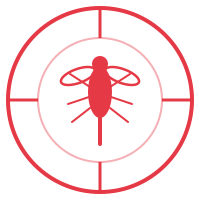
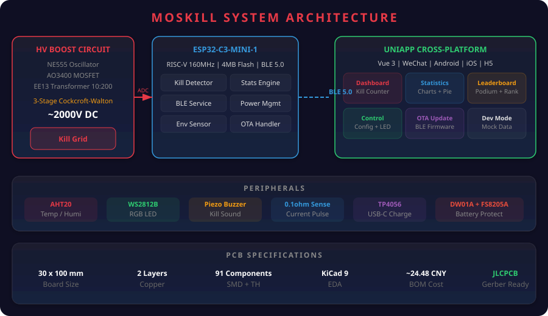
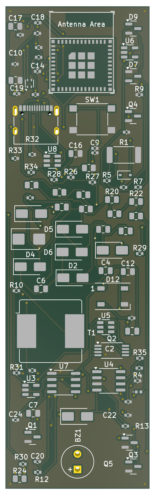
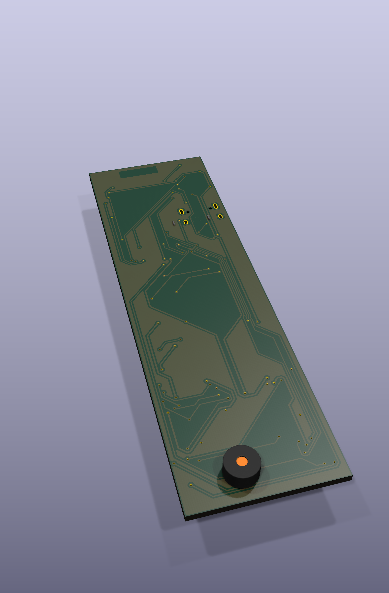
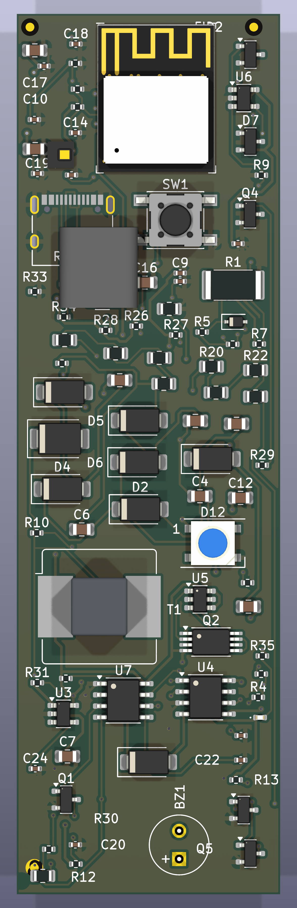
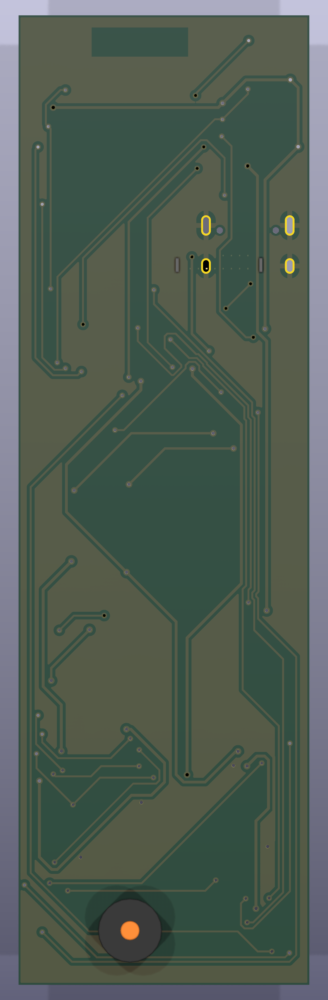

<p align="center">
  
</p>

<h1 align="center">MosKill</h1>
<p align="center">
  <strong>Smart Mosquito Swatter with BLE, Kill Counting & Statistics</strong><br/>
  <em>ESP32-C3 Firmware + KiCad PCB + UniApp Cross-Platform Client</em>
</p>

<p align="center">
  
  
  
  
  
  
  
</p>

---

## System Architecture

<p align="center">
  
</p>

## Features

- **Kill Detection** — Current pulse analysis, 4-class classification (S Fruit Fly / M Mosquito / L House Fly / XL Moth)
- **Statistics Engine** — Total kills, streak records, hourly heatmap, size distribution, efficiency scoring
- **Environment Correlation** — AHT20 temp/humidity sensing, mosquito activity vs. environment cross-analysis
- **BLE 5.0** — Real-time kill notifications, stats read, device config, OTA firmware update
- **UI Feedback** — WS2812B color-coded kill effects, streak rainbow animation, buzzer sound FX
- **Power Management** — 18650 Li-ion USB-C charging, 5-min auto deep sleep (5uA)
- **Cross-Platform App** — WeChat Mini Program / Android / iOS / H5, i18n (zh/en), dev mode
- **Fully AI-Designed** — From empty directory to manufacturable Gerber, zero human intervention

## PCB Design

30 x 100 mm narrow strip designed to fit inside a mosquito swatter handle. 91 components, dual-layer with full GND pour.

<p align="center">
  
  &nbsp;&nbsp;&nbsp;&nbsp;
  
  &nbsp;&nbsp;&nbsp;&nbsp;
  
  &nbsp;&nbsp;&nbsp;&nbsp;
  
</p>
<p align="center"><em>Left to right: 3D Top, 3D Bottom, Flat Top, Flat Bottom</em></p>

## Hardware

| Component | Part | Function |
|-----------|------|----------|
| MCU | ESP32-C3-MINI-1 | RISC-V 160MHz, BLE 5.0, 4MB Flash |
| HV Boost | NE555 + AO3400 + EE13 Transformer (10:200) | 3.7V -> ~2000V DC |
| HV Multiplier | 3-stage Cockcroft-Walton (UF4007 + 1nF/2kV) | Voltage tripler |
| Current Sense | 0.1ohm + LMV358 (Gain=20) + BAT43 Peak Det | Kill waveform capture |
| Env Sensor | AHT20 (I2C) | Temp +/-0.3C / Humidity +/-2%RH |
| Power | 18650 + TP4056 + ME6211 LDO | USB-C charging, 3.3V regulated |
| Battery Protect | DW01A + FS8205A | Over-charge/discharge/current protection |
| LED | WS2812B | RGB status + kill effects |
| Buzzer | KCG0601 Passive Piezo | Kill sound FX + streak rising tone |

> Full schematic: [`hardware/kicad/moskill.kicad_sch`](hardware/kicad/moskill.kicad_sch) | BOM: [`hardware/bom/BOM.csv`](hardware/bom/BOM.csv) | Gerber: [`hardware/kicad/moskill-gerbers.zip`](hardware/kicad/moskill-gerbers.zip)

## Project Structure

```
moskill/
├── firmware/                        # ESP-IDF v5.4 firmware (938KB binary)
│   ├── main/                        # Entry point, 6 FreeRTOS tasks
│   └── components/
│       ├── kill_detector/           # 4-state kill detection FSM
│       ├── stats_engine/            # Statistics + NVS sharded storage
│       ├── ble_service/             # BLE GATT server + OTA handler
│       ├── env_sensor/              # AHT20 I2C driver (thread-safe)
│       ├── power_mgmt/             # Battery curve, HV control, deep sleep
│       └── hv_driver/              # WS2812B RMT driver
├── hardware/
│   ├── kicad/                       # KiCad 9 schematic + PCB (30x100mm)
│   ├── bom/BOM.csv                  # 48 line items, ~¥24.48
│   └── renders/                     # 3D and flat PCB renders
├── app/                             # UniApp cross-platform client
│   └── src/
│       ├── pages/                   # 7 pages (dashboard, stats, rank, control, ota, ...)
│       ├── components/MkIcon.vue    # SVG icon component (38 icons)
│       ├── utils/
│       │   ├── ble.js               # BLE communication layer (128-bit UUIDs)
│       │   ├── icons.js             # SVG icon definitions
│       │   ├── i18n.js              # Chinese/English auto-switch
│       │   └── mock.js              # Dev mode mock data generator
│       └── store/index.js           # Vuex state management
├── protocol/ble_protocol.md         # BLE GATT protocol specification
├── tools/ble_debug/                 # Python BLE debug tool (bleak + rich)
└── docs/DESIGN.md                   # Full system design document
```

## Build Firmware

```bash
# Install ESP-IDF v5.4+
# https://docs.espressif.com/projects/esp-idf/en/latest/esp32c3/get-started/

cd firmware
idf.py set-target esp32c3
idf.py build                         # -> build/moskill.bin (938KB)
idf.py -p /dev/ttyUSB0 flash monitor
```

## Build App

```bash
cd app
npm install
npx uni build                        # H5 build
npx uni build -p mp-weixin           # WeChat Mini Program
npx uni dev:h5                       # H5 dev server

# Dev mode: no device needed, uses mock data for UI development
```

## Kill Detection Pipeline

```
ADC 1kHz sampling -> Threshold trigger -> Sustain check (>=5ms)
    -> Peak capture -> Envelope match -> Classification -> Stats update
    -> BLE notify -> LED + Buzzer feedback

Classification by peak ADC:
  S  (< 800)    Fruit Fly
  M  (800-2000) Mosquito
  L  (2000-3200) House Fly
  XL (> 3200)   Moth / Beetle
```

## BLE Protocol

128-bit custom UUIDs (base `e3a1XXXX-f5e8-4c8a-9b3d-2c1f7b8a6d50`), packed wire format for efficiency.

| Service | UUID Short | Description |
|---------|-----------|-------------|
| MosKill Main | `0x1B00` | Kill count (notify), session/lifetime stats, kill log, environment |
| Config | `0x1B11` | Sensitivity, LED, buzzer, streak effects + time sync |
| OTA | `0x1B21` | Firmware update (start/write/verify/abort with CRC32) |
| Battery | `0x180F` | Standard Battery Service |

> Full protocol spec: [`protocol/ble_protocol.md`](protocol/ble_protocol.md)

## BLE Debug Tool

```bash
cd tools/ble_debug
pip install -r requirements.txt

python moskill_ble.py scan                          # Scan devices
python moskill_ble.py stats <ADDR>                  # Read statistics
python moskill_ble.py monitor <ADDR>                # Real-time kill monitor
python moskill_ble.py config <ADDR> -s 2 -b 3      # Set sensitivity/buzzer
python moskill_ble.py ota <ADDR> firmware.bin       # BLE OTA update
```

## License

MIT
